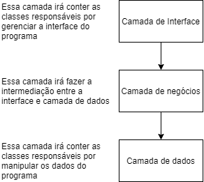

# Trabalho Final

**Professor: Dener Augusto de Lisboa Brandão**

**Núm de integrantes: 2 alunos**

## Diário em Linha de Comando

A prática de *journaling* (diário) tem se popularizado nos últimos anos entre os desenvolvedores.
Nesses diários, os desenvolvedores costumam anotar suas reflexões e pensamentos acerca de seus estudos, pesquisas, e trabalhos.
Muitos desses desenvolvedores adquiriram o hábito de [escrever diariamente](https://bennettgarner.medium.com/why-every-developer-should-keep-a-daily-code-journal-fb83ab848c6), transformando seu diário em um log de atividades.

Recentemente, esses desenvolvedores tem inclusive adotados métodos extremamente simples para anotações de seus afazeres, utilizando inclusive [programas](https://jrnl.sh/en/stable/) com interface em linha de comando.
Neste trabalho, você irá utilizar os conceitos introduzidos na disciplina para implementar, da melhor forma possível, seu próprio programa de *journaling*.
Este trabalho deverá implementar as seguintes funcionalidades:

1. Inserção de novas entradas
2. Listagem e filtragem das entradas existentes
3. Possibilidade de exportar as entradas para arquivo externo, no formato `json` ou `csv` 

As seções abaixo irão descrever em mais detalhes os requisitos e funcionalidades do projeto a ser desenvolvido.

### Arquitetura Geral

Seu programa será executado localmente na máquina do usuário e, portanto, deverá contar com uma interface gráfica e um módulo de armazenamento externo.
A Figura abaixo apresenta uma proposta de arquitetura geral para o programa, baseada no modelo de arquitetura de camadas.
Opcionalmente você pode seguir outro modelo arquitetural, desde que tecnicamente justificado.



Como se pode observar, esse modelo é composto por três camadas.
A camada de apresentação conterá classes que serão responsáveis por exibir informações na tela do usuário, incluindo a classe que irá controlá as opções de menu, bem como as demais classes e métodos que irão exibir algum dado na tela para o usuário.
A camada intermediária conterá classes relacionadas as regras de negócio da aplicação. Essas classes irão, basicamente, receber os dados fornecidos pelo usuário na camada de apresentação, fazer os devidos tratamentos e conversões, e por fim encaminhar esses dados para a chamada dos métodos e funções na camada de dados.
Por fim, nós temos a camada de dados, responsável pelas classes e métodos que irão gerir o modelo de dados do programa.

As classes a serem implementadas em seu programa deverá respeitar o modelo arquitetural descrito acima.

### Camada de Dados

A implementação de seu programa deverá conter uma classe para representar cada uma das entradas no diário.
Essa classe deverá possuir os seguintes campos:

* Texto: texto fornecido para entrada do diário
* Data: data de registro  da entrada no diário
* Categorias: uma lista de categorias associadas a entrada do diário

#### Persistência

Com relação a persistência, os dados poderão ser armazenados no formato que você julgar mais conveniente (arquivo texto, banco de dados, etc).
Contudo, é importante ressaltar que a classe responsável por fazer a gestão dessa persistência deverá implementar um padrão **singleton**; isto é, apenas uma única instância da classe deverá ser capaz de armazenar/recuperar os dados em um arquivo externo.

#### Exportação

Além disso, é importante observar que a ação de exportar deverá ser realizada também por classes presentes na camada de dados.
Nesse caso, você também deverá implementar um padrão de projeto entre essas classes para facilitar a implementação a seleção do tipo de exportação a ser feita na camada de negócios; recomenda-se nesse caso o uso do padrão **abstract factory**.
*Dica: utilize bibliotecas externas para lhe ajudar no processo de exportação das entradas para o formato desejado, ex: [GSON](https://github.com/google/gson).*

#### Filtragem

Por fim, a ação de filtragem também deverá ser executada nessa camada.
Você deverá fornecer três opções de filtragem das entradas do journal:

* Por texto, onde será filtrada as mensagens que contenham uma `substring` do texto desejado.
* Por data, onde será filtrada as mensagem que estejam dentro de uma faixa de datas, fornecidas pelo usuário previamente na interface
* Por categoria, onde serão filtradas as mensagens pertencentes a uma determinada categoria

Naturalmente, o usuário poderá filtrar pela combinação desses métodos.
Para facilitar essa combinação, você deverá implementar esse mecanismo de filtragem utilizando o padrão **decorator**.

Por fim, você deverá implementar uma classe de teste unitário para verificar se os mecanismos de filtragem estão funcionando corretamente.
Sua classe de teste deverá testar:

* Se as entradas corretas estão sendo retornadas pelo filtro substring
* Se as entradas corretas estão sendo retornadas pelo filtro data
* Se as entradas corretas estão sendo retornadas pelo filtro categoria
* Se as entradas corretas estão sendo retornadas pelos filtros substring & data
* Se as entradas corretas estão sendo retornadas pelos filtros substring & categoria
* Se as entradas corretas estão sendo retornadas pelos filtros data & categoria
* Se as entradas corretas estão sendo retornadas pelos três filtros

### Camada de Negócios

Nessa camada, você deverá implementar, necessáriamente, um método responsável pela execução de cada uma das ações referentes as funcionalidades listadas inicialmente.
Isto é, você deverá implementar métodos específicos para (a) inserir nova entrada no diário, (b) filtrar as entradas de acordo com os critérios estabelecidos previamente, e (c) exportar as entradas do diário para um arquivo externo.

Além disso, será necessário realizar a conversão de alguns dados, fornecidos pelo usuário, para objetos Java dentro do seu programa (ex.: conversão da `String` representando uma data para um objeto do tipo `Date`).
Implemente uma classe auxiliar responsável por essas conversões.
Implemente uma classe de testes unitários para testar os métodos presentes nessa classe.

### Camada de Apresentação

A camada de apresentação deverá conter as classes responsáveis por gerenciar tudo relacionado a interface com usuário, incluindo a classe `Main` do programa.
Como essa interface será voltada para linha de comando, você deverá implementar os métodos para exibição das opções de menu para cada uma das funcionalidades; veja exemplo abaixo:

```
Seja bem vindo ao Journaling.

Selecione uma das opções abaixo:
1. Nova entrada
2. Filtrar entradas
3. Exportar entradas
4. Sair
```

Além disso, cada uma das opções deverá ser executada em um procedimento (método) específico.

# Entrega

O trabalho deverá ser **entregue até o dia 07/07/2023**, no formato de pull request a este repositório.
Você deverá entregar no pull request o projeto contendo o código desenvolvido do programa. Ainda, forneça no próprio pull-request checklist preenchido, representando o cumprimento das tarefas:

- [ ] Arquitetura geral
- [ ] Camada de dados
  - [ ] Classe de modelo
  - [ ] Classe de persistência
  - [ ] Classe de exportação
  - [ ] Teste dos filtros
- [ ] Camada de Negócios
  - [ ] Classe utilitária
  - [ ] Método para inserção de entrada
  - [ ] Método para filtragem de entradas
  - [ ] Método para exportação das entradas
- [ ] Camada de apresentação
  - [ ] Método para exibição dos itens de menu
  - [ ] Métodos contendo a chamada de cada uma das funcionalidades
